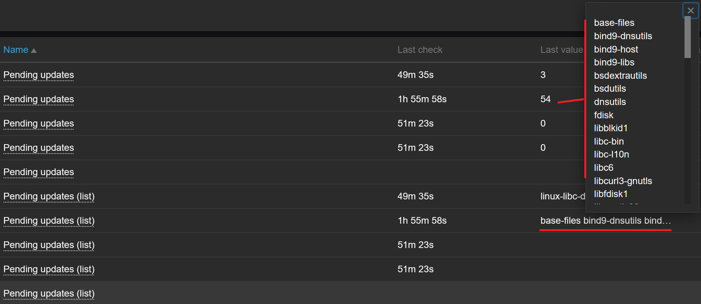

# Linux Security Compliance and patch Management with Ansible and Zabbix

## Overview

This script integrates Ansible with Zabbix for patch management, basic security compliance reporting, and alerting.

It helps automate package updates, lock/unlock critical packages, and forward results to Zabbix for centralized monitoring and alerting. It can be run manually or scheduled (e.g., via cron), and works without requiring a Zabbix agent on each managed host.

## Features

- **Ansible Playbook Generation:** Dynamically builds modular playbooks based on the detected package manager.
- **Package Management:** Supports locking/unlocking packages to control updates.
- **Compliance & Security Auditing:** Uses Ansible facts and filters to gather host state, including kernel and security-relevant data.
- **SSH and Privilege Support:** Connects via SSH using keys and supports privilege escalation with `--become`.
- **Zabbix Integration:** Sends compliance and patching results to Zabbix. Optionally generates an Ansible inventory by querying the Zabbix API for enabled hosts with the linked template.
- **Error Reporting:** Captures and forwards Ansible execution errors to Zabbix.
- **Flexible Configuration:** Configurable via command-line arguments or script variables.

## Zabbix considerations

- Target hosts must exist in Zabbix and be linked to the **"Linux - Security and compliance"** template, which includes the required items and triggers.
- For logging, the **"Linux - Security and compliance - ansible log"** template can be added to the host running this script (typically a jump server) to trap logs sent via Zabbix sender.
- When generating the Ansible inventory using the Zabbix API, any host that only has `127.0.0.1` as its interface will be ignored.
- When generating the Ansible inventory using the Zabbix API, hosts with only 127.0.0.1 as an interface will be ignored unless the {$ANSIBLE_HOST} macro is defined. This macro can also be used to override any interface address.
- When querying Zabbix API, it will get the `templateid` from **Linux - Security and compliance**. Don't change the name of the template.
- Ensure API user has correct permissions to read hosts and templates.
- When using the Zabbix API to retrieve hosts and host groups, any whitespace will be replaced with underscores. Note that `--limit` is case-sensitive — watch for uppercase letters.

## Files included

- zbx_linux_security_compliance.py: Python script
- zbx_linux_security_compliance.yaml: Zabbix templates
- discover.sh: Sh script to discover hosts with SSH open port and create Ansible inventory file

## Prerequisites

- SSH key pair
- Ansible 2.9+
- Python 3.9+
- Zabbix 7.2+

Install required Python libraries:

    pip install ansible ansible-runner argparse shutil json re os zabbix-utils pyyaml requests

Install required Ansible collection:

    ansible-galaxy collection install community.general
	
## Usage

To configure the script, set some of the following parameters:
- INVENTORY_PATH
- ZABBIX_SERVER
- ZABBIX_HOST
- USER_LOGIN
Optionally:
- ZABBIX_API
- API_TOKEN

Additional parameters can be set or overridden via command-line arguments:

    -h, --help            show this help message and exit
    --inventory INVENTORY, -i INVENTORY
                          Path to the inventory file. Default is '/etc/ansible/hosts'.
    --zabbix-server ZABBIX_SERVER
                          The Zabbix server FQDN or IP address.
    --zabbix-host ZABBIX_HOST
                          The Zabbix host to send logs.
    --limit LIMIT, -l LIMIT  
                          Limit the scope of the operation (e.g., 'host1' or 'group1'). Default is 'all'.
    --upgrade, -u         Set to 'yes' to enable upgrade mode (default is 'no').
    --ignore-sshcheck, -k
                          Ignore SSH check (useful for testing without valid SSH keys).
    --become, -b          Run commands with elevated privileges (default is 'no').
    --verbose, -v         Increase verbosity. Use -v for basic verbosity, -vv for more detailed.
    --user USER           Username for authentication.
    --ssh-key SSHKEY, -K SSHKEY
                          Path to the SSH private key for authentication.
    --forks FORKS, -f FORKS
                          Number of parallel forks to use during the operation (default is 5).
    --package-manager PACKAGE_MANAGER
                          Package manager to use (e.g., apt, yum, dnf).
    --lock-packages LOCK_PACKAGES, -L LOCK_PACKAGES
                          Lock specific packages to prevent updates or changes.
    --unlock-packages UNLOCK_PACKAGES, -U UNLOCK_PACKAGES
                          Unlock specific packages for updates or changes.
    --timeout TIMEOUT, -t TIMEOUT
                        Ansible SSH timeout (default is 10).

## Examples

### Updates list:

### Alerts:

## Some ideas to add in future realeases

- Include checks to get (some may require Zabbix agent):
  - Firewall rules (nftables, ufw).
  - List of listening ports.
  - Users logged in.
  - Log audit.
  - Autorized/Denied processes.
  - Check /var/run/reboot-required.
- Implement a "dry-run" (ansible --check-mode).
- Add APK (for Alpine distros).
- Make optional case insensitive when "--limit" hosts or hostgroups.
- Use Zabbix action scripts to execute this script on a specific host (without Ansible inventory).
